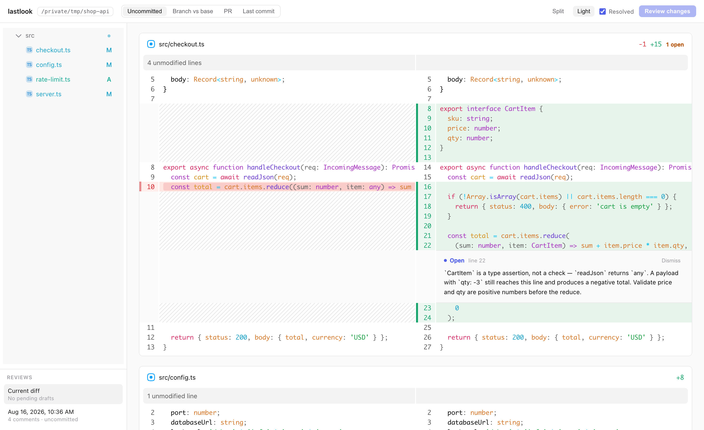
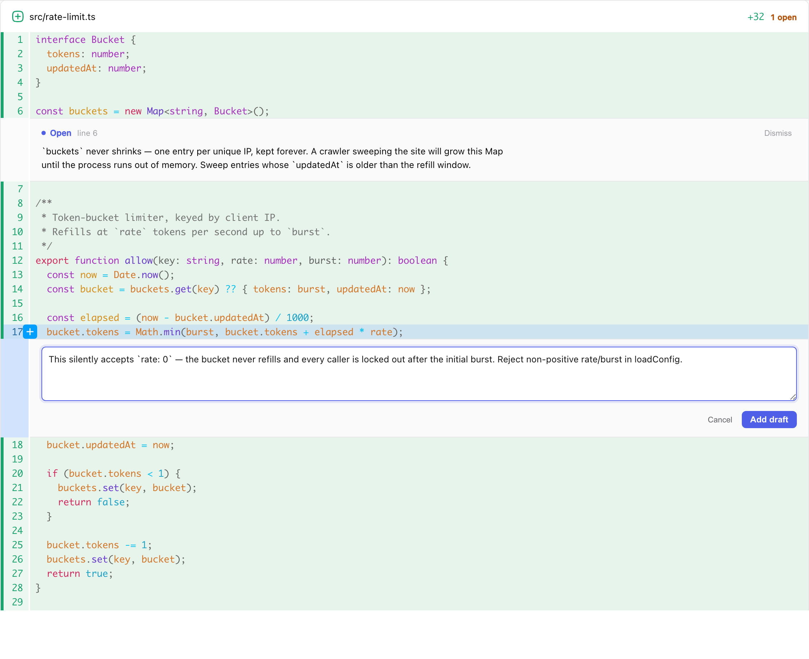
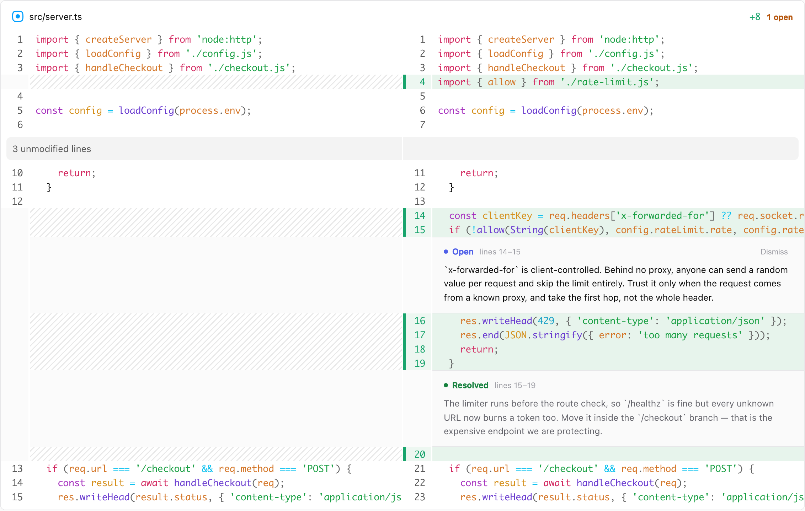

# lastlook

**One last look before you ship.**

A local code-review app for agent-written changes. Run it in any git repo, review the diff in your browser with inline comments, then tell your agent to fix them.

```sh
cd your-repo
npx lastlook
```

Everything stays on localhost. Nothing is written into the repo you review.



## Why

Agents write a lot of code. Terminal scroll-back is a bad place to read it.

lastlook gives you a real diff viewer with inline comments — and closes the loop: the comments go out over a local HTTP API, so the agent that wrote the code fixes them and marks them resolved while you watch.

## The loop

**1. Comment.** Click a line, or drag a range. Draft comments, then submit them as one review. Submitting pins a snapshot of the diff, so later edits never shift your comments.



**2. Hand it back.** In your agent, run `/resolve-lastlook`. It reads the open comments over HTTP, fixes each one, and flips it to resolved. The chips update live in the browser.



**3. Repeat.** Comments the agent disagrees with stay open with an explanation — dismiss them yourself. The next round is a new review.

## Install the agent skill

`resolve-lastlook` ships through the [skills CLI](https://github.com/vercel-labs/skills), which installs it for Claude Code, Codex, Cursor, and friends:

```sh
npx skills add maciekzygmunt/lastlook --skill resolve-lastlook
```

lastlook never installs skills itself and never writes files into your repo.

## Diff modes

Pick one in the top bar:

| Mode | Shows |
| --- | --- |
| **Uncommitted** (default) | Worktree vs `HEAD`, untracked files included |
| **Last commit** | `HEAD~1` vs `HEAD` |
| **Branch** | `HEAD` vs its merge-base with the repository's default branch (`origin/main`, or whatever `origin/HEAD` points at) — committed work only, editable base |
| **PR** | The current branch's pull request on GitHub, resolved for you through the `gh` CLI — no number to look up |

Uncommitted and Last commit refresh themselves: while an agent works, the diff updates on screen within a few seconds. Your expanded files, file-tree state and single-file focus are kept, and the refresh holds off while you type a comment. Branch and PR stay exactly as loaded.

## Reference

**Requirements:** Node ≥ 20 and git. `gh` (authenticated) only for PR mode.

**Flags:**

| Flag | Effect |
| --- | --- |
| `--open` | Also launch the browser (`$BROWSER` overrides the platform opener) |
| `--force` | Replace an already-running lastlook for this repo |

Without `--force`, a second launch prints the running server's URL and exits. The server takes port 4700, scanning upward on conflict.

**Data:** reviews live in `~/.lastlook/` (override with `$LASTLOOK_DATA_DIR`), keyed by repo path. Past reviews are read-only in the sidebar; the last 5 settled ones are kept. Delete the folder any time — your repos are untouched.

## Development

npm-workspaces monorepo:

| Package | What it is |
| --- | --- |
| `packages/server` | Hono API + CLI — the published `lastlook` package |
| `packages/web` | React UI, bundled into the server package at build time |
| `skills/resolve-lastlook` | The agent skill |

```sh
npm install
npm run build      # web UI, then server (copies web dist into the package)
npm test           # all workspaces, including an npm-pack integration test
npm run dev        # server on tsx, serving the last-built web UI
```

Contributions welcome — open an issue or PR.

## License

[MIT](LICENSE) © Maciej Zygmunt
